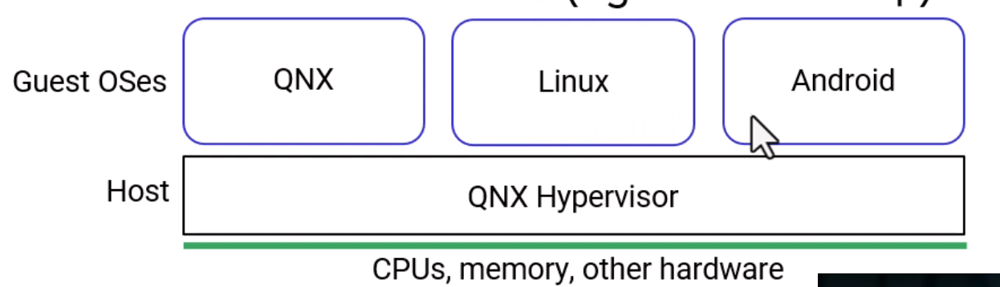
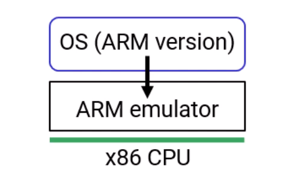
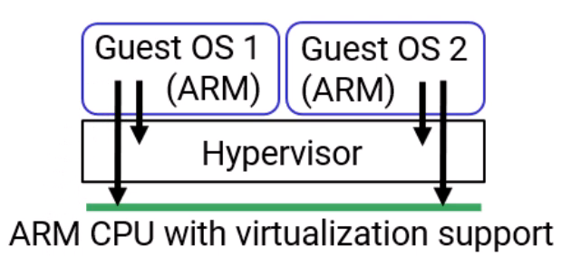
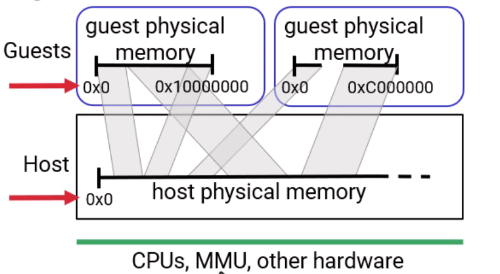

# QNX Hypervisor Architecture

## Overview

This document summarizes the architecture of the QNX Hypervisor, covering its definition, design, configuration, and memory management.

---

## What is the QNX Hypervisor?

**Definition:** Software that runs multiple operating systems on the same SoC (System on Chip) / board.

**Example Use Case:**
- Run QNX, Linux, and Android simultaneously on a single board
- Reduces hardware costs (e.g., fewer boards needed in vehicles)

---

## Hypervisor vs. Emulator

|  |  |
|---|---|


| Aspect | Emulator | Hypervisor |
|--------|----------|------------|
| Instruction Execution | Every instruction emulated | Most instructions execute directly on CPU |
| Performance | Slow (1 guest instruction = 10-1000 host instructions) | Fast (bare metal speed) |
| Hardware Requirement | Can emulate different architectures (e.g., ARM on x86) | Guest OS must match CPU architecture |
| Example | QEMU | QNX Hypervisor |

**Key Point:** With a hypervisor, only *some* instructions are trapped and emulated; most run directly on the hardware.

---

## Supported Guests and Hardware

### Guest Operating Systems
- QNX 8
- Linux (Ubuntu 20.04)
- Android

**Note:** From the hypervisor's perspective, Linux and Android are identical (both are Linux kernels).

### Hardware Support
- 64-bit OSes only
- x86-64
- ARMv8 (AArch64)

### Additional Features (QAVF)

**QNX Advanced Virtualization Framework** provides:
- Shared graphics between guests
- Audio
- Touch screen support
- Virtual sockets
- File systems

---

## QNX Hypervisor Architecture

### Core Design Principle

**Layer Structure (Top to Bottom):**

| Layer | Components |
|-------|------------|
| Guests | QNX Guest, Linux Guest, Android Guest |
| Virtual Machine Managers | qvm process (one per guest) |
| Host | Normal QNX with procnto (microkernel + process manager), drivers, io-sock, other processes |
| Hardware | CPU, Memory, Devices |

### Key Points
- One qvm process per guest - each guest runs as a normal QNX process
- The hypervisor layer is simply normal QNX
- All components together are called the host
- qvm processes are standard QNX processes managed by procnto

---

## Demonstration Setup

### Hardware Used
- Raspberry Pi board with QNX installed
- Serial connection (USB) to laptop
- Static IP configuration for networking

### Steps to Run Guests

**Step 1: Boot QNX Host**
- Connect via serial terminal
- Configure network interface with ifconfig

**Step 2: Start QNX Guest**

Command:
``` bash
cd /data/guest/qnx then qvm qnx-rpi.qvmconf
```

**Step 3: Start Linux Guest**

Command: 
``` bash    
cd /data/guest/linux then qvm linux-rpi.qvmconf
```
### Guest Directory Contents

**QNX Guest:**
- qnx-boot-image - Standard QNX boot image (created with mkifs)
- qnx-rpi.qvmconf - Configuration file

**Linux Guest:**
- Image - Linux kernel (built with Yocto)
- ramdisk.img - RAM disk image (built with Yocto)
- linux-rpi.qvmconf - Configuration file

---

## Configuration Files

Configuration files use the .qvmconf extension and describe the virtual machine setup.

### Configuration Options

| Option | Description | Example |
|--------|-------------|---------|
| system | Name for the virtual machine | system linux-guest |
| ram | Amount of RAM and starting address | ram 512M,loc 0x40000000 |
| cpu | Number of virtual CPUs for the guest | cpu 2 |
| load | Guest code/images to load | load ./Image |
| cmdline | Kernel command line arguments | cmdline "root=/dev/ram rw" |
| vdev | Virtual devices | vdev pl011 loc 0x9000000 |
| pass | Passthrough mapping for direct hardware access | pass loc 0xfd500000,guestloc 0x40000000,len 0x1000 |

### Virtual Devices (vdev)

Examples of virtual devices:
- Timers
- Interrupt controllers
- Serial ports (e.g., PL011 for ARM, ser8250 for x86)
- Block devices
- Networking hardware

### Passthrough (pass) Option

**Purpose:** Create direct mapping between host physical address and guest address space

**Format:** pass loc [host_addr],guestloc [guest_addr],len [size]

**Characteristics:**
- Used for device memory (e.g., video memory)
- Bypasses the hypervisor for direct access
- Memory is not zero-filled (faster boot times)
- Also called bypass since it bypasses hypervisor

---

## Memory Architecture


### Address Space Terminology

| x86 Terminology | ARM Terminology | Description |
|-----------------|-----------------|-------------|
| Guest Physical Address (GPA) | Intermediate Physical Address (IPA) | What the guest sees as physical memory |
| Host Physical Address (HPA) | Physical Address (PA) | Actual physical memory on hardware |

**Note:** QNX documentation uses x86 terminology for clarity.

### Memory Mapping Layers

| Layer | Description | Managed By |
|-------|-------------|------------|
| Guest Virtual Address | Virtual memory used by guest processes | Guest OS |
| Guest Physical Address | What guest sees as physical memory (contiguous) | qvm sets up mapping |
| Host Physical Address | Actual physical memory (may be non-contiguous) | Hardware |

### Two-Layer Page Table Translation

| Layer | Managed By | Purpose | Implementation |
|-------|------------|---------|----------------|
| Stage 1 | Guest OS | Virtual to Guest Physical | Standard page tables |
| Stage 2 | qvm | Guest Physical to Host Physical | Extended Page Tables (x86) / Stage 2 Tables (ARM) |

### Key Memory Concepts

**1. Memory Allocation Process**
1. qvm reads ram option from configuration file
2. qvm requests memory from QNX process manager
3. Process manager allocates memory (zero-filled)
4. qvm programs MMU with Stage 2 mapping
5. Guest sees contiguous physical address space

**2. Memory Protection**
- Guests cannot access outside their allocated address space
- MMU enforces protection automatically
- Same protection mechanism as non-virtualized systems

**3. Address Differences**
- Guest Physical Address is typically different from Host Physical Address
- Example: Guest sees address 0x0, but actual location is 0x40000000
- MMU handles translation transparently

**4. Zero-Fill Behavior**

| Memory Type | Zero-Filled | Boot Time Impact |
|-------------|-------------|------------------|
| ram option | Yes | Slower |
| rom option | Yes | Slower |
| pass option | No | Faster |

**5. Typed Memory Trick**
- Set up typed memory in QNX host to reserve RAM for private usage
- Use pass option to map this RAM into guest physical address space
- Results in non-zero-filled RAM for faster boot times

**6. Memory Limitations**

Total guest memory is limited by:
- Host physical memory
- Memory used by other guests
- Memory used by host processes (procnto, drivers, io-sock, etc.)

---

## Unity Guests

### Definition

A guest where Guest Physical Address equals Host Physical Address (1:1 mapping)

### Example Mapping

| Guest Physical Address | Host Physical Address |
|------------------------|----------------------|
| 0x0 | 0x0 |
| 0x1000000 | 0x1000000 |
| 0x2000000 | 0x2000000 |

### Characteristics
- MMU is still involved (mapping still programmed)
- One-to-one address translation
- Complex to configure

### When to Use
- When no IOMMU is available
- Discussed in detail in the Safety video

**Recommendation:** Consult QNX engineering for Unity guest configuration.

---

## How Virtual Machines Work - Summary

### Instruction Execution Model

| Instruction Type | Behavior | Performance |
|------------------|----------|-------------|
| Most instructions | Execute directly on CPU | Bare metal speed |
| Virtualization-aware instructions | CPU adds minimal extra work | Negligible overhead |
| Trapped instructions | Caught and emulated by hypervisor | Some overhead |

### What Gets Trapped?
- Access to certain memory addresses
- Specific privileged instructions (e.g., SMC on ARM)
- Device I/O operations

### Guest Awareness
- **Standard virtualization:** Guest thinks it is running on real hardware
- **Para-virtualization:** Guest knows it is running on a hypervisor (covered in next video)

---

## Quick Reference

### Commands

| Action | Command |
|--------|---------|
| Start a guest | qvm [config-file].qvmconf |
| View running guests | pidin grep qvm |

### Sample QNX Guest Config

| Option | Value |
|--------|-------|
| system | qnx-guest |
| ram | 128M,loc 0x48000000 |
| cpu | 2 |
| load | ./qnx-boot-image |
| vdev | ser8250 loc 0x3f8 |
| pass | loc 0xfd500000,guestloc 0x40000000,len 0x1000 |

### Sample Linux Guest Config

| Option | Value |
|--------|-------|
| system | linux-guest |
| ram | 400M,loc 0x40000000 |
| cpu | 2 |
| load | ./Image |
| load | ./ramdisk.img |
| cmdline | root=/dev/ram rw console=ttyAMA0 |
| vdev | pl011 loc 0x9000000 |
| vdev | virtio-blk loc 0xa000000 |

---

## Key Takeaways

1. QNX Hypervisor enables multiple OSes on one SoC, reducing hardware costs
2. Not an emulator - most instructions run at bare metal speed
3. Architecture: One qvm process per guest, running on normal QNX
4. Configuration via .qvmconf text files describing RAM, CPUs, devices, and mappings
5. Memory uses two-layer MMU translation (Stage 1 + Stage 2)
6. Guest isolation enforced by MMU - guests cannot access outside their address space
7. Passthrough allows direct hardware access, bypassing virtualization overhead
8. Unity guests provide 1:1 address mapping for special use cases (no IOMMU)

---

## Glossary

| Term | Definition |
|------|------------|
| Host | The QNX system running the hypervisor and qvm processes |
| Guest | An operating system running inside a virtual machine |
| qvm | QNX Virtual Machine - the process that manages each guest |
| GPA | Guest Physical Address - what the guest sees as physical memory |
| HPA | Host Physical Address - actual physical memory on hardware |
| IPA | Intermediate Physical Address - ARM terminology for GPA |
| MMU | Memory Management Unit - handles address translation |
| Stage 2 | Second layer of address translation for virtualization |
| Passthrough | Direct mapping of device memory to guest address space |
| Unity Guest | Guest with 1:1 GPA to HPA mapping |
| QAVF | QNX Advanced Virtualization Framework |
| procnto | QNX microkernel containing process manager |
| vdev | Virtual device configured for a guest |