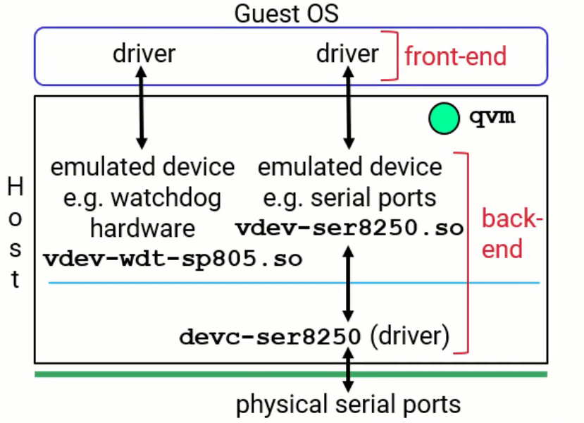
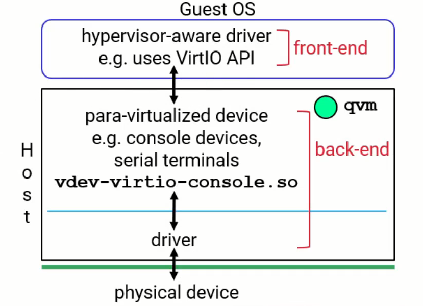
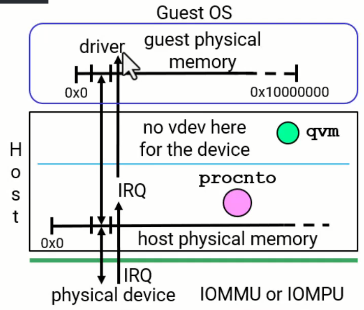

# QNX Hypervisor - Configuring Devices for Guests

## Overview

This document covers the three types of devices you can configure for guests in the QNX Hypervisor: emulated devices, para-virtualized devices, and pass-through devices.

---

## Three Types of Devices

| Device Type | Category | Guest Driver | Guest Awareness |
|-------------|----------|--------------|-----------------|
| Emulated | Virtual Device (vdev) | Normal I/O | Unaware of hypervisor |
| Para-virtualized | Virtual Device (vdev) | VirtIO API | Aware of hypervisor |
| Pass-through | Direct Hardware Access | Normal I/O to actual hardware | Bypasses hypervisor |

---

## Virtual Devices (vdevs)

**Definition:** Virtual devices include both emulated and para-virtualized devices.

**Terminology:** vdev = virtual device (commonly used shorthand)

---

## Type 1: Emulated Devices

### Description

- Hardware is emulated in software
- May or may not have actual hardware underneath
- Guest treats it like normal hardware
- Guest performs normal I/O operations (x86 Port I/O, memory-mapped I/O, interrupt handling)
- Guest runs normal drivers with no modifications
- Guest is unaware that a hypervisor exists

### How It Works

| Step | Action |
|------|--------|
| 1 | QVM reads configuration file and sees vdev line |
| 2 | QVM creates filename: vdev-[name].so |
| 3 | QVM loads shared object using dlopen |
| 4 | QVM programs address into virtualization hardware |
| 5 | When guest driver accesses that address, virtualization hardware traps it |
| 6 | Guest stops, QVM is notified |
| 7 | QVM calls into the loaded vdev code to handle the operation |
| 8 | Operation is emulated, guest continues |

### Configuration Example

**Configuration line:** vdev wdt-sp805 with loc 0x1000000

**Resulting shared object:** vdev-wdt-sp805.so

### Built-in vdevs

Some emulation vdevs are built into QVM (statically linked):

- Interrupt controller chip vdevs
- Timer vdevs

These do not require a separate .so file but can still be configured in the configuration file for settings like interrupt numbers and addresses.

### Backend Options

| Configuration | Description |
|---------------|-------------|
| Standalone vdev | vdev code handles everything internally |
| vdev with backend process | vdev communicates via IPC with another process that talks to actual hardware |

### Terminology

| Term | Definition |
|------|------------|
| Front-end | The driver in the guest |
| Back-end | Any other components needed to support the driver |

---

## Type 2: Para-virtualized Devices

### Description

- Requires a special driver on the guest
- Driver uses VirtIO API instead of normal I/O
- VirtIO is an API created by the Linux community
- Has a standards committee that QNX follows closely
- Guest driver is aware that a hypervisor exists

### VirtIO

| Aspect | Details |
|--------|---------|
| Origin | Linux community |
| Purpose | Standardized API for virtual device communication |
| Components | Virt queues for reading and writing data |
| Standards | Maintained by standards committee, QNX follows versions closely |

### How It Works

| Step | Action |
|------|--------|
| 1 | QVM reads configuration file and sees vdev virtio-* line |
| 2 | QVM creates filename: vdev-virtio-[name].so |
| 3 | QVM loads shared object using dlopen |
| 4 | Guest driver performs VirtIO API calls |
| 5 | Virtualization hardware traps the call, stops guest |
| 6 | QVM calls into vdev code to handle VirtIO operation |
| 7 | vdev handles virt queues and may communicate with backend process |
| 8 | Guest continues |

### Configuration Example

**Configuration line:** vdev virtio-blk with loc 0x2000000

**Resulting shared object:** vdev-virtio-blk.so

### Why Para-virtualized

| Aspect | Explanation |
|--------|-------------|
| Origin | Greek word para meaning adjacent to |
| Meaning | Part of driver logic is in guest, part is in host (adjacent to each other) |
| Key characteristic | Guest uses VirtIO instead of normal I/O |

---

## Type 3: Pass-through Devices

### Description

- Driver in guest deals directly with actual hardware
- Bypasses the hypervisor
- Creates a mapping between host physical address and guest physical address
- Programming the MMU page tables to create the mapping
- Guest driver has exclusive access to hardware

### How It Works

| Step | Action |
|------|--------|
| 1 | Configuration file specifies pass option with addresses |
| 2 | QVM creates mapping in MMU page tables |
| 3 | Guest driver maps physical address into its virtual address space |
| 4 | Driver accesses hardware directly without hypervisor intervention |

### Configuration Example

**Configuration line:** pass loc 0xfd500000,guestloc 0x40000000,len 0x1000

| Parameter | Description |
|-----------|-------------|
| loc | Host physical address (actual hardware address) |
| guestloc | Guest physical address (where guest sees it) |
| len | Length of memory region to map |

### Important Considerations

| Consideration | Details |
|---------------|---------|
| Exclusive access | Only one guest should access the hardware at a time |
| Host access | Host should not touch the hardware either |
| No enforcement | Nothing technically prevents multiple access, but avoid it |
| Shared access | If sharing is needed, use an intermediary process for synchronization |

### Pass-through for Interrupts

| Aspect | Details |
|--------|---------|
| Configuration | Use pass option to configure interrupt pass-through |
| Reality | Not true pass-through; interrupts are routed by host to guests |
| Terminology | Called pass-through interrupts because configured with pass option |

### DMA Considerations

| Component | Purpose |
|-----------|---------|
| IOMMU | Address translation and protection for DMA |
| IOMPU | Protection only for DMA |

See the Safety video for more details on IOMMUs.

---

## Comparison of Device Types

| Feature | Emulated | Para-virtualized | Pass-through |
|---------|----------|------------------|--------------|
| Guest driver type | Normal | VirtIO-enabled | Normal |
| Guest awareness | Unaware | Aware | Unaware |
| Performance | Trapped and emulated | Trapped and emulated | Direct hardware access |
| Configuration | vdev [name] | vdev virtio-[name] | pass loc,guestloc,len |
| Shared object | vdev-[name].so | vdev-virtio-[name].so | None |
| Hardware access | Through emulation | Through VirtIO | Direct |

---

## Configuration File Examples

### Emulated Device (Watchdog Timer)

**vdev wdt-sp805** with **loc 0x1000000** and **intr gic:36**

### Para-virtualized Device (Block Device)

**vdev virtio-blk** with **loc 0x2000000**, **intr gic:48**, and **peer blk:vdev**

### Pass-through Device (Memory Region)

**pass loc 0xfd500000,guestloc 0x40000000,len 0x1000**

---

## Architecture Summary

### Emulated Device Architecture

| Layer | Component |
|-------|-----------|
| Guest | Normal driver doing normal I/O |
| Trap | Virtualization hardware traps access |
| QVM | Calls vdev shared object code |
| Backend (optional) | IPC to driver process talking to actual hardware |
| Hardware (optional) | Actual physical device |

### Para-virtualized Device Architecture

| Layer | Component |
|-------|-----------|
| Guest | VirtIO driver doing VirtIO API calls |
| Trap | Virtualization hardware traps access |
| QVM | Calls vdev-virtio shared object code |
| Backend (optional) | IPC to driver process talking to actual hardware |
| Hardware (optional) | Actual physical device |

### Pass-through Device Architecture

| Layer | Component |
|-------|-----------|
| Guest | Normal driver accessing mapped address |
| MMU | Translates guest physical to host physical |
| Hardware | Actual physical device accessed directly |

---

## Key Takeaways

1. Three device types: emulated, para-virtualized, and pass-through
2. Emulated and para-virtualized are both virtual devices (vdevs)
3. Emulated devices use normal I/O, guest is unaware of hypervisor
4. Para-virtualized devices use VirtIO API, guest is aware of hypervisor
5. Pass-through creates direct mapping to hardware, bypasses hypervisor
6. vdevs are loaded as shared objects (.so files) by QVM
7. Some vdevs are built into QVM (interrupt controllers, timers)
8. Pass-through requires exclusive access to avoid conflicts
9. For shared devices, use an intermediary process for synchronization
10. Pass-through interrupts are not true pass-through; they are routed through host

---

## Glossary

| Term | Definition |
|------|------------|
| vdev | Virtual device (emulated or para-virtualized) |
| VirtIO | Virtual I/O API created by Linux community |
| Pass-through | Direct hardware access bypassing hypervisor |
| Front-end | Driver in the guest |
| Back-end | Supporting components for the driver |
| dlopen | Function to dynamically load shared objects |
| Virt queues | Queues used in VirtIO for data transfer |
| IOMMU | I/O Memory Management Unit for DMA address translation |
| IOMPU | I/O Memory Protection Unit for DMA protection |
| Para | Greek for adjacent to |