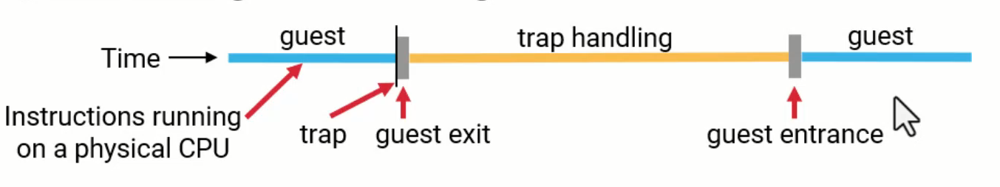
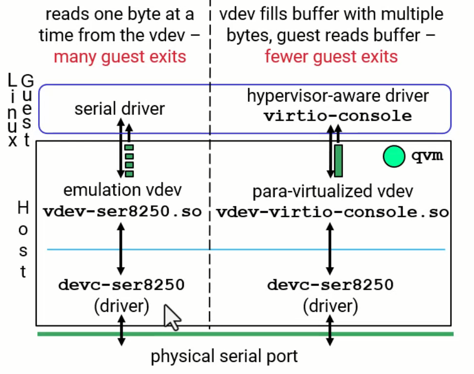
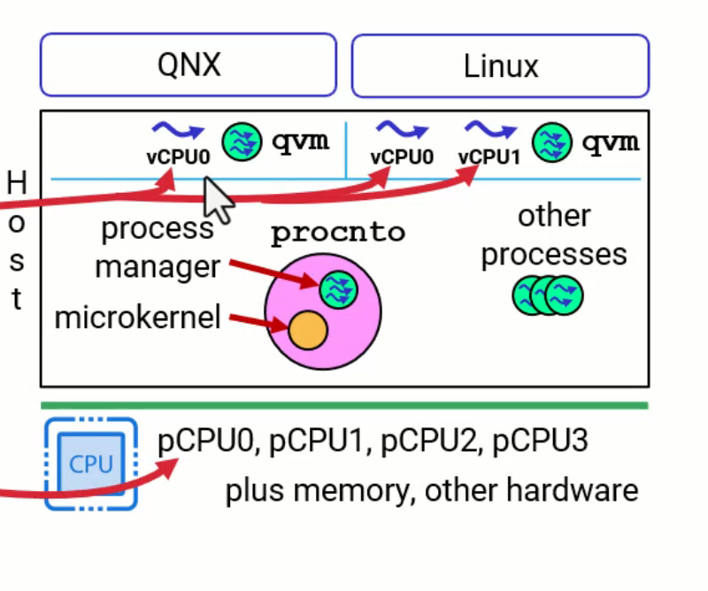
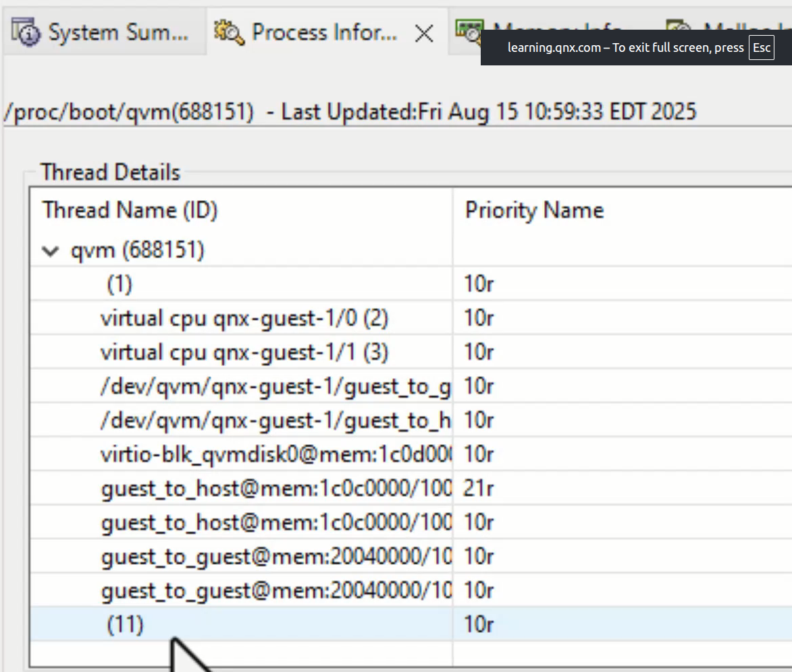

# QNX Hypervisor - Running Guest Code

## Overview

This document explains how guest code runs in the QNX Hypervisor, including guest exits, virtual CPUs, scheduling, and performance tuning.

---

## Where Do Guests Run

Most instructions execute directly on the CPU at bare metal speed. They are not emulated.

Some instructions have added virtualization support with minimal overhead.

Some things are trapped and handled:
- Certain instructions guests are not permitted to execute (like SMC on ARM)
- Accessing certain addresses configured for a vdev
- Operations requiring higher privilege levels

---

## Guest Exits and Guest Entrances


### Terminology

| Term | Definition |
|------|------------|
| Guest Exit | Guest stops running, control transfers to hypervisor |
| Guest Entrance | Hypervisor returns control to guest, guest resumes |
| Trap | Another term for guest exit, but rarely used in practice |

**Note:** When people say "guest exit" they typically mean the entire process: exit, handling, and entrance.

### The Process

| Step | What Happens |
|------|--------------|
| 1 | Guest runs normally, executing directly on CPU |
| 2 | Guest does something that triggers a trap |
| 3 | Virtualization hardware stops the guest (Guest Exit) |
| 4 | Virtualization hardware runs qvm |
| 5 | qvm saves guest state (registers, etc.) |
| 6 | qvm does the work (calls vdev code or handles internally) |
| 7 | qvm restores guest state |
| 8 | qvm jumps back into guest code (Guest Entrance) |
| 9 | Guest continues running directly on CPU |

### Timing

The guest exit and guest entrance (saving and restoring state) takes single-digit microseconds.

Most time is spent in the handling step.

---

## Example: Emulated Device Access

### Configuration
```
vdev wdt-sp805
loc 0x2c090000
```

### What Happens at Startup

| Step | Action |
|------|--------|
| 1 | qvm reads configuration file |
| 2 | qvm sees vdev line and creates filename vdev-wdt-sp805.so |
| 3 | qvm loads the shared object |
| 4 | qvm programs address 0x2c090000 into virtualization hardware |
| 5 | Virtualization hardware now watches for accesses to that address |

### What Happens During Runtime

| Step | Action |
|------|--------|
| 1 | Guest driver accesses address 0x2c090000 |
| 2 | Virtualization hardware detects the access |
| 3 | Virtualization hardware stops guest (Guest Exit) |
| 4 | qvm is notified and saves guest state |
| 5 | qvm calls vdev read or write handler function |
| 6 | vdev does the work (emulates watchdog timer) |
| 7 | vdev returns to qvm |
| 8 | qvm restores guest state (Guest Entrance) |
| 9 | Guest continues running |

---

## Causes for Guest Exits

### Guest-Initiated Causes

| Cause | Description |
|-------|-------------|
| Device register access | Accessing address configured by a vdev |
| Invalid memory access | Accessing memory outside guest address space |
| InterProcessor Interrupts | Kernel initiating IPIs to manage multiple CPUs |
| Privileged register access | Accessing certain system registers |
| Higher exception level request | Instructions like SMC on ARM |

### Host-Initiated Causes

| Cause | Description |
|-------|-------------|
| Hardware interrupts | Interrupts need to be routed through host to guest |
| vCPU preemption | Higher priority thread preempts vCPU thread |

---

## Minimizing Guest Exits

### Why Minimize

Each guest exit takes time. Even if handling is quick, frequent exits add up.

Minimizing guest exits gives guests more CPU time.

### Example: Emulation vs Para-virtualization


**Scenario:** Reading 4 bytes from a serial port

**Emulation Approach (vdev-ser8250)**

| Action | Guest Exits |
|--------|-------------|
| Read byte 1 | 1 |
| Read byte 2 | 1 |
| Read byte 3 | 1 |
| Read byte 4 | 1 |
| Total | 4 guest exits |

Driver does normal I/O, each byte access is trapped and emulated.

**Para-virtualized Approach (vdev-virtio-console)**

| Action | Guest Exits |
|--------|-------------|
| Read all 4 bytes via virtqueue | 1 |
| Total | 1 guest exit |

Driver uses VirtIO API, reads multiple bytes at once through virtqueue.

### How to Change

Simply change configuration file and use different driver in guest.

### Tuning with Kernel Event Log

| Step | Action |
|------|--------|
| 1 | qvm logs each guest exit to kernel event log |
| 2 | qvm logs each guest entrance to kernel event log |
| 3 | Capture log using tracelogger |
| 4 | Load log into IDE System Profiler perspective |
| 5 | Analyze guest exit frequency |
| 6 | Reconfigure and test again |

---

## Virtualization Support from CPU

### What It Means

Some instructions execute directly on CPU with extra work to support virtualization, without needing a guest exit.

### Example: Read Time Stamp Counter (x86)

| Without Virtualization Support | With Virtualization Support |
|--------------------------------|----------------------------|
| Guest reads TSC | Guest reads TSC |
| Trap occurs (guest exit) | No trap |
| qvm adds offset | CPU hardware adds offset |
| Guest entrance | Instruction completes |
| Significant overhead | Minimal overhead |

### How It Works

| Step | Action |
|------|--------|
| 1 | Hypervisor (qvm) programs offset value into virtualization hardware |
| 2 | Guest executes RDTSC instruction |
| 3 | CPU executes instruction and adds offset automatically |
| 4 | No guest exit needed |

CPU manufacturers continue adding more virtualization support for different operations.

---

## CPU Privilege Levels

### ARM Exception Levels

| Level | Privilege | What Runs There |
|-------|-----------|-----------------|
| EL0 | Least privileged | Guest applications |
| EL1 | More privileged | Guest kernel |
| EL2 | More privileged | Hypervisor |
| EL3 | Most privileged | Secure monitor |

### x86 Rings

| Ring | Privilege | What Runs There |
|------|-----------|-----------------|
| Ring 3 | Least privileged | Applications |
| Ring 0 | Most privileged | Kernel |

Note: x86 numbers are reversed compared to ARM.

### What Happens with Insufficient Privilege

| Step | Action |
|------|--------|
| 1 | Guest executes instruction requiring higher privilege (e.g., SMC) |
| 2 | Virtualization hardware detects this |
| 3 | Guest exit occurs |
| 4 | Appropriate privilege level is set |
| 5 | qvm runs and handles the request |

Guests run at lower privilege level than hypervisor microkernel.

---

## Virtual CPUs (vCPUs)

### What Are vCPUs
| Diagram | Description |
|---|---|
|  | Virtual CPUs are threads belonging to `qvm` that execute guest code.<br>Each vCPU is a normal QNX thread running in the `qvm` process. |

### Host Thread Structure

| Component | Threads |
|-----------|---------|
| procnto | Multiple threads |
| Other host processes | Multiple threads |
| qvm main | Main thread, resource manager thread |
| qvm vdevs | Threads created by vdevs (e.g., virtio-net, virtio-blk) |
| qvm vCPUs | One vCPU thread per configured virtual CPU |

### Viewing vCPU Threads in IDE

<table>
    <thead>
        <tr>
            <th>Thread Name</th>
            <th>Purpose</th>
            <th>IDE Thread View</th>
        </tr>
    </thead>
    <tbody>
        <tr>
            <td>main</td>
            <td>qvm main function</td>
            <td rowspan="7"></td>
        </tr>
        <tr>
            <td>(unnamed)</td>
            <td>Resource manager thread</td>
        </tr>
        <tr>
            <td>guest_to_guest</td>
            <td>Created by virtio-net vdev</td>
        </tr>
        <tr>
            <td>guest_to_host</td>
            <td>Created by virtio-net vdev</td>
        </tr>
        <tr>
            <td>blk thread</td>
            <td>Created by virtio-blk vdev</td>
        </tr>
        <tr>
            <td>linux-guest-vCPU0</td>
            <td>Virtual CPU 0 for linux guest</td>
        </tr>
        <tr>
            <td>linux-guest-vCPU1</td>
            <td>Virtual CPU 1 for linux guest</td>
        </tr>
    </tbody>
</table>

### Configuration
```
cpu
cpu
```

Each "cpu" line creates one vCPU thread.

Above configuration creates 2 virtual CPUs.

---

## When Do Guests Run

**Key Point:** The guest gets CPU time while its vCPU threads are scheduled.

### vCPU Thread Behavior

| Situation | vCPU Thread State | Guest State |
|-----------|-------------------|-------------|
| vCPU thread scheduled | RUNNING | Running on CPU |
| Higher priority thread preempts | READY | Stopped |
| Guest exit (trap handling) | RUNNING but executing vdev code | Stopped |

### What vCPU Threads Execute

| Situation | Code Being Executed |
|-----------|---------------------|
| Normal guest execution | Guest code (kernel image, applications) |
| Guest exit handling | vdev code or qvm internal code |

The same vCPU thread switches between guest code and vdev code.

### Scheduling Factors

| Factor | Effect |
|--------|--------|
| vCPU thread priority | Higher priority = more likely to run |
| Other thread priorities | Higher priority threads preempt vCPUs |
| Scheduling algorithm | Round-robin at same priority |
| CPU clusters | Limits which physical CPUs vCPU can use |

---

## Virtual CPUs vs Physical CPUs

### Important Rules

| Rule | Reason |
|------|--------|
| Do not configure more vCPUs than physical CPUs per guest | Only causes time slicing and preemption overhead |
| Total vCPUs across all guests may exceed physical CPUs | This is unavoidable with multiple guests |

### Example

| Configuration | Result |
|---------------|--------|
| 4 physical CPUs, 5 vCPUs for one guest | 5 threads compete for 4 CPUs, time slicing occurs |
| 4 physical CPUs, 2 vCPUs per guest, 3 guests | 6 total vCPUs, acceptable |

### From Guest Perspective

| Physical CPUs | Guest 1 vCPUs | Guest 2 vCPUs |
|---------------|---------------|---------------|
| 4 | 2 | 1 |

Guest 1 kernel thinks it has 2 cores.

Guest 2 kernel thinks it has 1 core.

Neither knows about the real 4 physical CPUs.

---

## Guest Priorities vs Host Priorities

### Separate Priority Domains

| Domain | Priority System |
|--------|-----------------|
| QNX Guest | 0 lowest, 255 highest |
| Linux Guest | 0 highest (reversed) |
| QNX Host | 0 lowest, 255 highest |

These priority systems are completely unrelated to each other.

### Priority Compression

Guest priorities are compressed into vCPU thread priorities.

**Example:**

| Guest | Thread Priority in Guest | vCPU Thread Priority in Host | Result |
|-------|--------------------------|------------------------------|--------|
| Linux | High priority thread | Priority 10 | Waits |
| QNX | Low priority thread | Priority 50 | Runs first |

The QNX guest low-priority thread runs before Linux guest high-priority thread because vCPU priority matters, not guest internal priority.

### Configuring vCPU Priority
```
cpu 
    sched 21
cpu 
    sched 21
```

This creates 2 vCPU threads, both at priority 21.

---

## CPU Clusters

### What Are Clusters

A cluster is a set of physical CPUs that threads can be restricted to.

Configured in startup code at boot time.

### Default Clusters in QNX 8

| Cluster Type | Contents |
|--------------|----------|
| all-cores cluster | All physical CPUs |
| individual-core clusters | One cluster per physical CPU |

With 4 cores, you have 5 default clusters.

### Common Use Cases

| Use Case | Cluster Configuration |
|----------|----------------------|
| big.LITTLE architecture | bigcpus cluster for high-performance cores |
| Worker thread isolation | Keep vCPUs away from worker thread clusters |
| Guest isolation | Dedicate specific cores to specific guests |

### Configuration Example

```
cpu 
    cluster bigcpus
cpu 
    cluster bigcpus
```


Both vCPU threads will run only on CPUs in the bigcpus cluster.

### Default Behavior

vCPU threads use qvm thread 1's cluster, which is usually all-cores.

### Important Rule

Do not configure multiple vCPUs for same guest on same individual-core cluster.

| Bad Configuration | Problem |
|-------------------|---------|
| 2 vCPUs both restricted to CPU 0 | Both threads compete for 1 CPU, must take turns |

---

## Troubleshooting Timing Issues

### Where Problems Show Up

| Symptom | Cause |
|---------|-------|
| Spinlock timeouts | vCPU preempted during spinlock iteration |
| Missed high-frequency interrupts | vCPU not running frequently enough |

### Resolution Steps (In Order)

| Priority | Action |
|----------|--------|
| First | Check that all code is written correctly (no CPU hogging at high priority) |
| Second | Arrange priorities of all threads (vCPU and host threads) |
| Last Resort | Configure clusters to limit vCPUs to specific CPUs |

### Code Writing Best Practice

| Bad Practice | Good Practice |
|--------------|---------------|
| High priority thread does all work | High priority thread does minimal work |
| Long running at high priority | Wake low priority thread to do heavy work |

---

## Summary

### When Do Guests Run

Guests run when their vCPU threads are scheduled.

Based on QNX priority-driven preemptive scheduling.

### Where Do Guests Run

Instructions execute directly on CPU with some having added virtualization support.

### What Causes Guests to Stop

| Cause | Description |
|-------|-------------|
| Trap | Guest does something requiring handling (device access, privileged instruction) |
| Preemption | Higher priority thread in host preempts vCPU thread |

### Key Configuration Options

| Option | Purpose |
|--------|---------|
| cpu | Create a vCPU thread |
| cpu sched N | Create vCPU thread at priority N |
| cpu cluster NAME | Create vCPU thread restricted to cluster NAME |

### Performance Tuning Priorities

| Order | Action |
|-------|--------|
| 1 | Write code correctly (avoid CPU hogging) |
| 2 | Arrange thread priorities appropriately |
| 3 | Configure clusters if needed |
| 4 | Minimize guest exits through configuration (virtio vs emulation) |

---

## Glossary

| Term | Definition |
|------|------------|
| Guest Exit | Guest stops, control transfers to hypervisor |
| Guest Entrance | Control returns to guest |
| vCPU | Virtual CPU thread in qvm that executes guest code |
| Trap | Event causing guest exit |
| Cluster | Set of physical CPUs for thread affinity |
| Spinlock | Tight loop waiting for lock, usually microseconds |
| big.LITTLE | ARM architecture with high-performance and low-power cores |
| TSC | Time Stamp Counter, x86 cycle counter |
| SMC | Secure Monitor Call, ARM instruction for TrustZone |
| EL | Exception Level, ARM privilege levels |
| Ring | x86 privilege levels |
| Virtualization Support | CPU features that handle operations without guest exit |