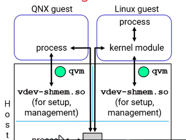
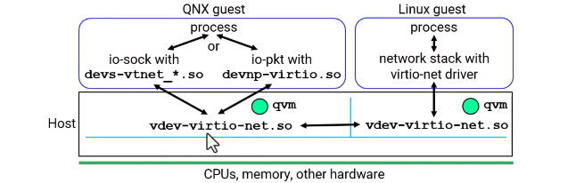
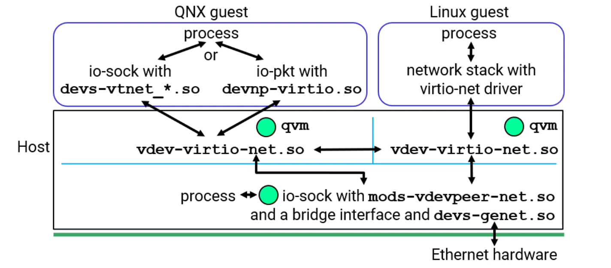

# QNX Hypervisor - Guest Communication

## Overview

This document explains how guests communicate with each other, with the host, and with the rest of the world in a QNX Hypervisor environment.

---

## Communication Methods

| Method | Use Case |
|--------|----------|
| Shared Memory | Fast data transfer between guests and host |
| Networking | Standard TCP/IP communication |
| Combination | Large data via shared memory, notifications via networking |

---

## Shared Memory Communication

    

### What It Provides

| Feature | Description |
|---------|-------------|
| Direct memory sharing | Processes in different guests can access same memory |
| Interrupt notification | When one process writes, others can be notified via interrupt |
| Fast data transfer | No network overhead, direct memory access |

### Required Components

| Component | Location | Purpose |
|-----------|----------|---------|
| vdev-shmem | Each guest configuration | Virtual device for shared memory setup |
| User space code | QNX guest | Simple code to access shared memory |
| User space code | QNX host | Simple code to access shared memory |
| Kernel module | Linux guest | Required for interrupt handling and physical memory mapping |

### Communication Flow

| Step | Action |
|------|--------|
| 1 | QNX guest process writes data to shared memory |
| 2 | vdev-shmem triggers interrupt notification |
| 3 | Linux kernel module receives interrupt |
| 4 | Kernel module notifies Linux user process |
| 5 | Linux process reads data from shared memory |
| 6 | Same flow works in reverse direction |

### Why Linux Needs Kernel Module

| Requirement | Reason |
|-------------|--------|
| Interrupt handling | Must be done in kernel space |
| Physical memory mapping | Cannot be done from user space |
| Notification to user process | Kernel module notifies user process of new data |

### Configuration Example

**Guest Configuration File:**

vdev shmem with name /dev/shmem0 and size 0x100000

### Sample Code Sources

| Guest Type | Where to Find Sample Code |
|------------|---------------------------|
| QNX Guest | Hypervisor BSPs from QNX Software Center |
| Linux Guest | https://gitlab.com/qnx/hypervisor/working-with-guests/shared-memory-device-example-for-linux-vdev-shmem |

### Documentation Location

QNX Hypervisor Documentation path: Using Virtual Devices then Networking and Shared Memory then Shared Memory section

---

## Networking Communication

### Three Scenarios

| Scenario | Description |
|----------|-------------|
| Guest-to-Guest | Processes in different guests communicate directly (peer-to-peer) |
| Guest-to-Host | Guest process communicates with host process |
| Guest-to-World | Guest process communicates with external network via Ethernet |

---

## Guest-to-Guest Networking (Peer-to-Peer)

    

### Description

Two guests communicate directly with each other using standard TCP/IP socket communication. No networking stack is needed in the host for this scenario.

### Required Components

| Component | Location | Purpose |
|-----------|----------|---------|
| vdev virtio-net | Each guest config file | Virtual network device |
| io-sock with devnp-virtio-net.so | QNX 8 guest | Network stack |
| virtio-net driver | Linux guest | Comes with Linux kernel |

### Configuration Steps

| Step | Action |
|------|--------|
| 1 | Add vdev virtio-net to each guest configuration file |
| 2 | Configure network stack in QNX guest (io-sock or io-pkt) |
| 3 | Configure network stack in Linux guest with virtio-net driver |
| 4 | Assign IP addresses to virtual interfaces |
| 5 | Use normal TCP/IP socket code to communicate |

### QNX 8 Guest Setup

| Component | Configuration |
|-----------|---------------|
| Config file | vdev virtio-net with loc and intr options |
| Network stack | io-sock -d virtio-net |
| Interface | ifconfig virt0 [ip_address] |

### Linux Guest Setup

| Component | Configuration |
|-----------|---------------|
| Driver | virtio-net (included with Linux) |
| Network stack | Standard Linux networking |
| Interface | Configure with ip or ifconfig commands |

### Key Point

Once configuration is done, use normal socket-level communication. Standard TCP/IP code works without modification.

---

## Guest-to-Host Networking

    

### Description

Guest processes communicate with a process running on the QNX host. This requires additional configuration in the host.

### Additional Components Needed

| Component | Location | Purpose |
|-----------|----------|---------|
| io-sock | Host | Network stack process |
| vdevpeer-net module | Host | Enables communication with guest vdevs |

### Required Configuration

| Location | Configuration |
|----------|---------------|
| Guest config file | vdev virtio-net (same as peer-to-peer) |
| Guest | Network stack (same as peer-to-peer) |
| Host | io-sock with vdevpeer-net.so module |

### Host Network Stack Command

io-sock -d vdevpeer-net

### Communication Flow

| Step | Flow |
|------|------|
| 1 | Guest process sends TCP/IP packet |
| 2 | Goes through guest network stack |
| 3 | Goes through vdev virtio-net |
| 4 | Goes through vdevpeer-net module in host |
| 5 | Goes through io-sock in host |
| 6 | Reaches host process |

### Performance Note

Communication is fairly efficient. Under the hood, it is basically memcpy operations.

---

## Guest-to-World Networking

### Description

Guest processes communicate with external devices over physical Ethernet hardware.

### Additional Components Needed

| Component | Location | Purpose |
|-----------|----------|---------|
| io-sock | Host | Network stack process |
| vdevpeer-net module | Host | Communication with guest vdevs |
| Ethernet driver | Host | Driver for physical hardware (e.g., devs-genet.so) |
| Bridge interface | Host | Connects virtual and physical interfaces |

### Required Configuration

| Location | Configuration |
|----------|---------------|
| Guest config file | vdev virtio-net |
| Guest | Network stack |
| Host | io-sock with vdevpeer-net.so AND physical Ethernet driver |
| Host | Bridge interface between vdevpeer and Ethernet |

### Host Network Stack Command

io-sock -d vdevpeer-net -d devs-genet

(Replace devs-genet with your Ethernet hardware driver)

### Bridge Configuration

Create a bridge interface that connects the vdevpeer interface and the physical Ethernet interface.

### Communication Flow

| Step | Flow |
|------|------|
| 1 | Guest process sends TCP/IP packet |
| 2 | Goes through guest network stack |
| 3 | Goes through vdev virtio-net |
| 4 | Goes through vdevpeer-net module |
| 5 | Goes through bridge interface |
| 6 | Goes through Ethernet driver |
| 7 | Goes out physical Ethernet hardware |
| 8 | Reaches external world |

---

## Documentation Reference

### Shared Memory Documentation

Path: QNX Hypervisor Documentation then Using Virtual Devices then Networking and Shared Memory then Shared Memory

### Networking Documentation

| Scenario | Documentation Section |
|----------|----------------------|
| Guest-to-Guest | Peer-to-peer networking configuration |
| Guest-to-Host | Host vdevpeer configuration |
| Guest-to-World | Bridge and Ethernet configuration |

---

## Combining Methods

### Use Case

Transfer large amounts of data (megabytes) efficiently while maintaining notification capability.

### Approach

| Method | Purpose |
|--------|---------|
| Shared Memory | Transfer large data blocks |
| Networking | Send notification that data is ready |

### Example Flow

| Step | Action |
|------|--------|
| 1 | Guest process writes large data to shared memory |
| 2 | Guest process sends small TCP/IP message to host |
| 3 | Message tells host that data is ready |
| 4 | Host process reads data from shared memory |

### Benefits

| Benefit | Description |
|---------|-------------|
| Fast data transfer | Shared memory avoids network overhead for large data |
| Simple notification | Socket communication provides reliable signaling |
| Flexibility | Each method used for its strength |

---

## Summary

### Communication Options

| Scenario | Recommended Method |
|----------|-------------------|
| Large data between guests/host | Shared Memory |
| Standard communication | Networking (TCP/IP) |
| Large data with notification | Combination of both |

### Configuration Summary

| Scenario | Guest Config | Guest Setup | Host Setup |
|----------|--------------|-------------|------------|
| Shared Memory | vdev shmem | User code (QNX) or kernel module (Linux) | User code |
| Guest-to-Guest | vdev virtio-net | Network stack | None needed |
| Guest-to-Host | vdev virtio-net | Network stack | io-sock with vdevpeer-net |
| Guest-to-World | vdev virtio-net | Network stack | io-sock with vdevpeer-net, Ethernet driver, bridge |

### Key Takeaways

1. Shared memory requires vdev-shmem and provides interrupt notification
2. Linux guests need kernel module for shared memory due to interrupt and memory mapping requirements
3. Networking uses standard TCP/IP sockets once configured
4. Guest-to-guest networking does not require host network stack
5. Guest-to-host networking requires vdevpeer-net module in host
6. Guest-to-world networking requires bridge between vdevpeer and Ethernet
7. Combining methods allows efficient large data transfer with simple notification

---

## Glossary

| Term | Definition |
|------|------------|
| vdev-shmem | Virtual device for shared memory communication |
| vdev virtio-net | Virtual network device using VirtIO |
| vdevpeer-net | Host module for communicating with guest vdevs |
| io-sock | QNX 8 network stack process |
| io-pkt | QNX 7.x network stack process |
| devnp-virtio-net.so | QNX 8 VirtIO network driver |
| devnp-virtio.so | QNX 7.x VirtIO network driver |
| Bridge interface | Connects two network interfaces together |
| Peer-to-peer | Direct guest-to-guest communication |